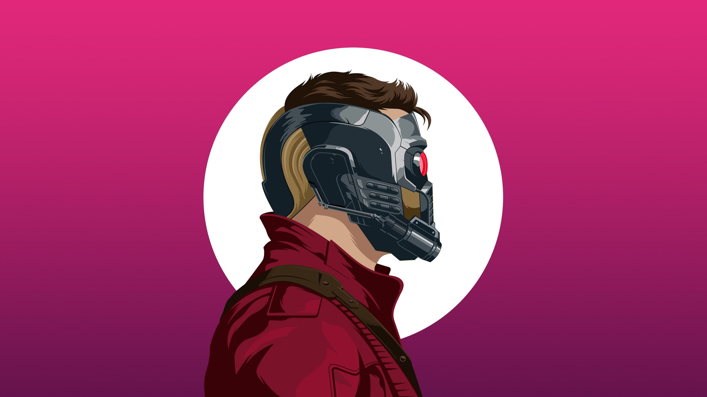

# i3wm Dotfiles

Nordic-themed i3 window manager setup for Pop!_OS / Ubuntu 22.04.



---

## Fresh Install (3 steps)

```bash
git clone https://github.com/virtual-lad/i3wm.git ~/i3wm
cd ~/i3wm && bash install.sh
gnome-session-quit
```

At the login screen → click the gear icon ⚙️ → select **i3** → log in.

---

## What Gets Installed

| Category | Tools |
|---|---|
| Window Manager | i3-wm, i3status, i3lock |
| Terminal | Alacritty |
| Shell | Zsh + Oh My Zsh |
| Launcher | Rofi |
| Compositor | Picom |
| Wallpaper | Feh |
| Screenshots | Scrot, Flameshot |
| Clipboard | CopyQ |
| Bluetooth TUI | Bluetui (via cargo) |
| Brightness | Brightnessctl |
| Media | Playerctl |
| Font | JetBrainsMono Nerd Font |

---

## Keybindings

`Mod` = Super (Win) key

### Applications
| Action | Shortcut |
|---|---|
| Terminal | `Mod + Enter` |
| Browser | `Mod + Shift + Enter` |
| App Launcher | `Mod + D` |
| Clipboard Menu | `Mod + V` |
| Screenshot (GUI) | `Print` |

### Workspaces
| Action | Shortcut |
|---|---|
| Switch to workspace | `Mod + 1-9` |
| Move window to workspace | `Mod + Shift + 1-9` |
| Protected workspace | `Mod + 0` |

### Windows
| Action | Shortcut |
|---|---|
| Focus | `Mod + Arrow keys` |
| Move window | `Mod + Shift + Arrow keys` |
| Close window | `Mod + Shift + Q` |
| Fullscreen | `Mod + F` |
| Float toggle | `Mod + Shift + F` |
| Resize mode | `Mod + R` |
| Split horizontal | `Mod + H` |
| Split vertical | `Mod + Shift + V` |

### System
| Action | Shortcut |
|---|---|
| Lock screen | `Mod + L` |
| Lock + Suspend | `Mod + Shift + L` |
| Reload config | `Mod + Shift + C` |
| Restart i3 | `Mod + Shift + R` |
| Exit i3 | `Mod + Shift + E` |

### Media & Brightness
| Action | Shortcut |
|---|---|
| Volume up/down | `XF86AudioRaiseVolume / Lower` |
| Mute | `XF86AudioMute` |
| Play/Pause | `XF86AudioPlay` |
| Brightness up/down | `XF86MonBrightnessUp / Down` |

---

## File Structure

```
i3wm/
├── config            # i3 main config
├── i3status.conf     # status bar config
├── wallpaper.png     # desktop wallpaper
├── lock_icon.png     # lock screen icon
├── screen_lock.sh    # lock screen script
├── protected_ws.sh   # encrypted workspace script
├── install.sh        # bootstrap script
├── requirements.txt  # package list
└── README.md
```

---

## Touchpad

The config includes touchpad support for both Dell and Lenovo laptops.
If your touchpad isn't working, find your device name:

```bash
xinput list
```

Then update the `xinput set-prop` lines at the bottom of `config` with your device name.

---

## Theme

**Nordic** color scheme by SkyyySi.

| Element | Color |
|---|---|
| Background | `#2E3440` |
| Active border | `#81A1C1` |
| Focused workspace | `#A3BE8C` |
| Urgent | `#D08770` |
